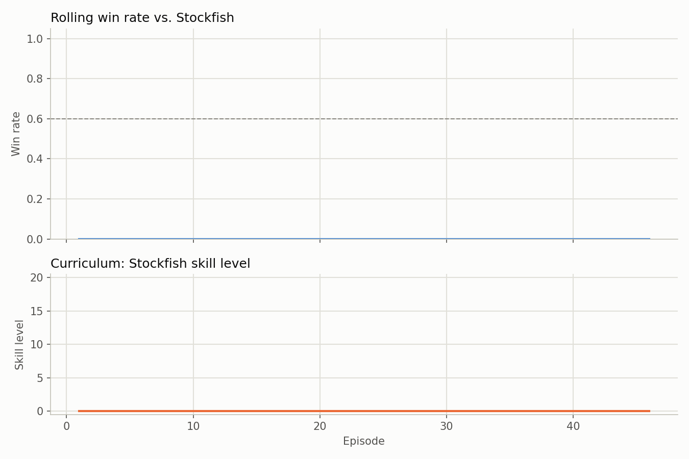

# chess-curriculum-rl

A chess-playing agent trained from scratch with reinforcement learning (PPO),
using **curriculum learning**: it starts against a uniform-random mover, then
graduates through Stockfish Skill Level 0-20, only advancing once its recent
win rate against the current opponent clears a threshold. This is a
learning/portfolio project, not an attempt at a state-of-the-art engine — see
[Limitations](#limitations).

## Motivation

Training an agent directly against a strong, fixed opponent gives almost no
reward signal early on (constant losses), which is a slow, noisy start for
RL. Curriculum learning addresses this by matching the opponent's strength to
the agent's current skill: easy enough to win sometimes and get a learning
signal, hard enough to keep pushing. This project explores that idea
end-to-end, from a custom Gymnasium environment through to a UCI-compatible
engine binary and an unattended "watch it play" demo.

## Architecture

```
ChessEnv (gymnasium.Env)  <---- opponent at the curriculum's current level:
   |  observation: (12, 8, 8) board tensor,       level 0 = random mover
   |  canonical to the side to move               levels 1-21 = Stockfish
   |  action: Discrete(64*64*5) = (from, to,         Skill Level 0-20
   |  promotion), action-masked
   v
MaskablePPO (sb3-contrib)  <---- ChessCNN feature extractor (src/policy.py)
   |
   v
CurriculumCallback  ---->  CurriculumManager (src/curriculum.py)
   tracks the last N game results, promotes the level on a win-rate
   threshold, and logs every result to logs/curriculum_log.csv
```

- **`src/env.py`** — the `ChessEnv` Gymnasium environment. Each episode the
  agent is randomly assigned White or Black and plays a full game against the
  curriculum's current opponent: a uniform-random legal-move picker at level
  0 (a bootstrap stage that needs no engine at all, so it's also the fastest
  part of training), or a Stockfish subprocess at Skill Level `level - 1` for
  levels 1-21. Reward is win/loss/draw at the end, plus a small
  material-difference term every move (`reward.material_reward_scale`) so
  the signal isn't purely sparse. The board is encoded **canonically**:
  channels 0-5 of the observation are always "my" pieces and 6-11 are always
  the opponent's (using `chess.Board.mirror()` when Black is to move), so one
  policy network plays both colors without needing to know which one it is.
  Actions are masked to legal moves via `action_masks()`, consumed by
  sb3-contrib's `MaskablePPO`.
- **`src/policy.py`** — `ChessCNN`, a small convolutional feature extractor
  (three conv layers + a linear head) plugged into SB3's policy/value network
  via `features_extractor_class`.
- **`src/curriculum.py`** — `CurriculumManager`: a rolling window of the last
  `window_size` game results; once the win rate clears `promotion_threshold`
  the opponent level goes up by one and the window resets. Every result is
  appended to a CSV log for later plotting, and the current level is also
  saved to `curriculum_state.json` so `--resume` picks up the same opponent
  strength instead of restarting at level 0.
- **`src/train.py`** — wires it all together: builds the env(s) (optionally
  `n_envs` of them in parallel, each with its own opponent process), the
  `MaskablePPO` model (with an entropy bonus, `training.ent_coef`, to keep
  exploring instead of settling into an early habit), a `CurriculumCallback`
  that promotes the opponent's level as training progresses, and periodic
  checkpoints.

## Setup

### 1. Python environment

Requires Python 3.11+.

```powershell
pip install -r requirements.txt
```

**If you already have a CUDA build of PyTorch installed** (check with
`python -c "import torch; print(torch.__version__, torch.cuda.is_available())"`),
`requirements.txt` pins a loose `torch` floor specifically so this command
won't silently replace it with a CPU-only wheel from PyPI. If you don't have
one yet, install a CUDA build first from
[pytorch.org/get-started/locally](https://pytorch.org/get-started/locally/),
then run the command above.

### 2. Stockfish

The environment shells out to a Stockfish binary via UCI. Easiest path on
Windows:

```powershell
winget install Stockfish.Stockfish
```

Then open a **new** terminal (PATH changes need a fresh shell) and confirm:

```powershell
stockfish
```

(type `quit` to exit). On macOS/Linux, use your package manager (`brew
install stockfish`, `apt install stockfish`, ...) or download a binary from
[stockfishchess.org](https://stockfishchess.org/download/). If it's not on
PATH, pass its full path via `--stockfish-path` (or the `stockfish_path` key
in the config YAML) wherever a script accepts it.

## Usage

### Training

```powershell
python src/train.py --config configs/default.yaml
```

Useful overrides:

```powershell
python src/train.py --config configs/default.yaml --timesteps 1000000 --start-level 0
python src/train.py --config configs/default.yaml --timesteps 1000000 --n-envs 8
python src/train.py --config configs/default.yaml --resume logs/checkpoints/ppo_chess_10000_steps.zip
```

`--resume` continues training the *same* model incrementally -- it is not a
restart. It loads the checkpoint's weights and also auto-resumes the
curriculum's current Stockfish skill level (saved alongside the checkpoint's
log directory as `curriculum_state.json`), so a resumed run keeps facing the
opponent strength it had already earned rather than dropping back to level 0.
Pass `--start-level` explicitly to override that.

`--n-envs` runs that many Stockfish opponents in parallel (each in its own
process), which roughly multiplies training throughput up to your CPU's core
count -- useful since PPO training here is opponent-bound (Stockfish's
per-move "thinking time"), not GPU-bound.

A small **smoke-test config** is included to quickly verify the whole
pipeline (env + curriculum + PPO + Stockfish) is wired correctly, without
waiting hours:

```powershell
python src/train.py --config configs/smoke_test.yaml
```

Training writes to `<log_dir>/`:
- `curriculum_log.csv` — every game's result, rolling win rate, and skill
  level, for plotting (see below)
- `checkpoints/` — periodic model checkpoints and the final model

Standard PPO training metrics (loss, entropy, explained variance, ...) print
to stdout via SB3's own logger (`verbose=1`). TensorBoard logging is
intentionally not wired in: its `gfile` backend doesn't reliably handle
native Windows paths and would break training on some machines.

### Plotting progress

```powershell
python src/plot_progress.py --log logs/curriculum_log.csv --out assets/training_progress.png
```



*(Chart above is from a short smoke-test run, included to demonstrate the
pipeline end-to-end — not a claim about final agent strength. Re-run the
plot script after a real training run to regenerate it.)*

### Evaluating a trained model

```powershell
python src/evaluate.py --model logs/checkpoints/ppo_chess_final.zip --stockfish-level 5 --num-games 20
```

### Watching it play (no input required)

```powershell
python src/watch.py --model logs/checkpoints/ppo_chess_final.zip --opponent stockfish --stockfish-level 5 --num-games 3
python src/watch.py --model logs/checkpoints/ppo_chess_final.zip --opponent self --delay 0.3
```

Prints the board in Unicode after every move, pauses `--delay` seconds
between moves, and after each game prints the result and the running score,
then starts the next game automatically.

### Using it as a UCI engine (Arena, ChessBase, cutechess, ...)

```powershell
python src/uci_engine.py --model logs/checkpoints/ppo_chess_final.zip
```

Speaks the core UCI handshake (`uci`, `isready`, `ucinewgame`, `position`,
`go`, `stop`, `quit`) over stdin/stdout. In your GUI's "install engine"
dialog, point it at a wrapper that runs this command (most GUIs don't pass
extra CLI args to the engine executable, so either hardcode the model path
via `DEFAULT_MODEL_PATH` in `src/uci_engine.py`, or use a GUI that lets you
specify command-line arguments for the engine).

### Optional: Lichess Bot API

`src/lichess_bot.py` lets a trained model play on Lichess as a BOT account.
**This requires you to manually create a dedicated Lichess BOT account and
API token first** — see the module's docstring for the exact steps. This is
not automated by this project.

```powershell
$env:LICHESS_BOT_TOKEN = "your-token-here"
python src/lichess_bot.py --model logs/checkpoints/ppo_chess_final.zip
```

## Testing

```powershell
pytest tests/
```

Tests that require a real Stockfish binary are skipped automatically if
`stockfish` isn't found on PATH.

## Limitations

- This is **not** an AlphaZero-style engine and won't reach anywhere near
  that strength. There's no Monte Carlo tree search, no self-play
  distillation loop, and no massive compute budget — it's a single PPO
  policy learning directly from game outcomes against Stockfish.
- The reward signal is sparse by design (win/loss/draw, plus an optional
  small material-difference shaping term). This is intentional for the
  learning goals of this project, but it does mean training is slower and
  noisier than a densely-shaped setup.
- Reaching higher Stockfish skill levels realistically needs a large number
  of timesteps (the default config targets millions of steps); the
  `configs/smoke_test.yaml` config is only there to verify wiring, not to
  produce a strong agent.
- Single-environment training (`DummyVecEnv` with `n_envs=1`) keeps the
  curriculum state simple to reason about, at the cost of not parallelizing
  Stockfish game collection across processes.

## Project structure

```
chess-curriculum-rl/
├── src/
│   ├── env.py              # ChessEnv (gymnasium wrapper)
│   ├── curriculum.py       # Skill-level tracking and promotion logic
│   ├── policy.py           # CNN feature extractor (SB3-compatible)
│   ├── train.py            # Main training script
│   ├── evaluate.py         # Evaluate a trained model vs. a fixed Stockfish level
│   ├── watch.py            # Unattended live-play demo
│   ├── uci_engine.py       # UCI protocol engine wrapper
│   ├── plot_progress.py    # Win-rate / curriculum-level chart
│   └── lichess_bot.py      # Optional Lichess Bot API integration
├── tests/
│   ├── test_env.py
│   └── test_curriculum.py
├── configs/
│   ├── default.yaml
│   └── smoke_test.yaml
├── logs/                   # Training logs/checkpoints (gitignored)
├── requirements.txt
└── README.md
```
